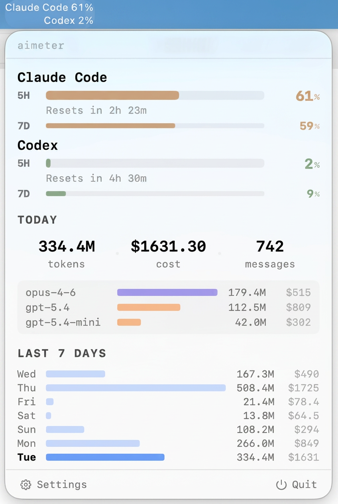

# aimeter

[](LICENSE)

[中文 README](README_CN.md)

A lightweight macOS menu bar app that tracks your [Claude Code](https://code.claude.com/) and [Codex CLI](https://github.com/openai/codex) usage in real time.

<p align="center">
  
</p>

## Features

- 5h / 7d rate limits read directly from Claude Code and Codex CLI local data — not estimates
- Daily and weekly token + cost stats, broken down by model
- Bilingual — auto-follows system locale (English / 中文)

## Install

### Homebrew (recommended)

```bash
brew tap wangyufeng0615/aimeter
brew install --cask aimeter
```

### Pre-built zip

Download from [Releases](https://github.com/wangyufeng0615/aimeter/releases), unzip, drag to Applications.

> If Claude Code is installed, aimeter prompts to add a `tee` hook to `~/.claude/settings.json` so it can read rate limits. Codex needs no setup.

## Privacy

aimeter runs entirely on your machine. The only outbound request fetches pricing data from the [LiteLLM](https://github.com/BerriAI/litellm) GitHub repo — no telemetry, no personal data. See [SECURITY.md](SECURITY.md) for details.

## Development

Build and contribution guide in [CONTRIBUTING.md](CONTRIBUTING.md).

## License

[MIT](LICENSE). Pricing data from [LiteLLM](https://github.com/BerriAI/litellm); cost calculation inspired by [ccusage](https://github.com/ryoppippi/ccusage).
