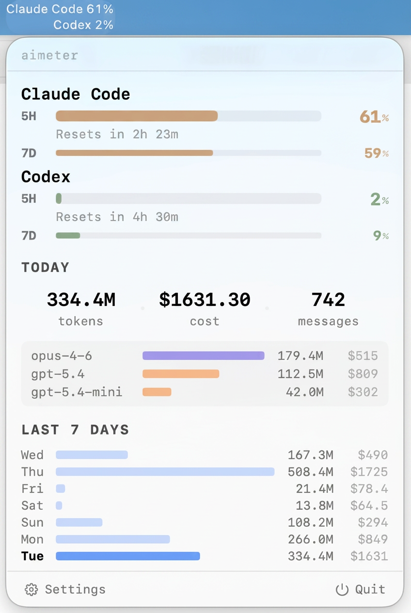

# aimeter

[](LICENSE)
[](https://github.com/wangyufeng0615/aimeter/releases)
[](https://github.com/wangyufeng0615/aimeter/commits)

[中文 README](README_CN.md)

A lightweight macOS menu bar app that tracks shared Claude subscription limits, plus local [Claude Code](https://code.claude.com/) and [Codex CLI](https://github.com/openai/codex) activity.

> A tool I use every day myself — carefully maintained for the long haul.

<p align="center">
  
</p>

## Features

- 5-hour / weekly Claude limit snapshots from local Desktop or Code data; Desktop snapshots expire after 30 minutes
- Token usage and cost breakdown from local Claude Code and Codex logs (desktop chat is not included)
- Claude limits are read from the latest local Claude Desktop or Claude Code snapshot; no usage data is uploaded

## Install

```bash
brew tap wangyufeng0615/aimeter && brew install --cask aimeter
```

Or grab the zip from [Releases](https://github.com/wangyufeng0615/aimeter/releases).

Updates are automatic — aimeter checks once a day and prompts inside the app. You can also trigger a check from Settings → Updates, or run `brew upgrade --cask aimeter` yourself.

> First launch asks to add a statusline hook for Claude Code. Codex needs no setup.

## Privacy

Usage parsing stays on your Mac and no CLI log content is uploaded. The app
makes two kinds of automatic outbound requests: model-pricing data from
[LiteLLM](https://github.com/BerriAI/litellm), and the Sparkle update feed hosted
on GitHub. If you approve an update, Sparkle downloads the signed release zip
from GitHub. There is no product telemetry. See [SECURITY.md](SECURITY.md) for
the exact read/write paths and network endpoints.

## Development

Build and contribution guide in [CONTRIBUTING.md](CONTRIBUTING.md).

## License

[MIT](LICENSE). Pricing data from [LiteLLM](https://github.com/BerriAI/litellm); cost calculation inspired by [ccusage](https://github.com/ryoppippi/ccusage).
