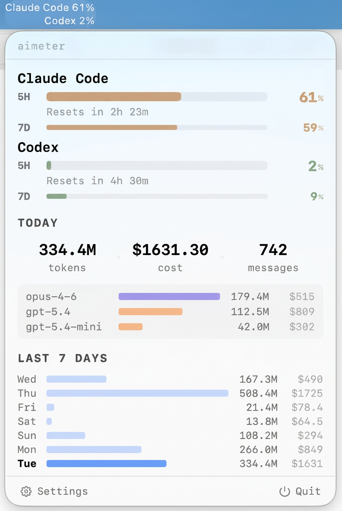

# aimeter

[](LICENSE)
[](https://github.com/wangyufeng0615/aimeter/releases)
[](https://github.com/wangyufeng0615/aimeter/commits)

[English README](README.md)

一个轻量级 macOS 菜单栏应用，实时监控你的 [Claude Code](https://code.claude.com/) 和 [Codex CLI](https://github.com/openai/codex) 用量。

> 作者日常自用的工具，会精心长期维护。

<p align="center">
  
</p>

## 特性

- 准确显示 5 小时限额 / 周限额
- 展示 token 用量和费用
- 只用 Claude Code / Codex 其中一个？另一个的面板会自动隐藏
- 用量和 rate limit 数据都从本地 CLI 文件读取，不上传使用数据

## 安装

```bash
brew tap wangyufeng0615/aimeter && brew install --cask aimeter
```

或从 [Releases](https://github.com/wangyufeng0615/aimeter/releases) 下载 zip。

自动更新：aimeter 每天自动检查新版本，在 app 内提示升级；也可以在设置 → 更新里手动触发，或直接运行 `brew upgrade --cask aimeter`。

> 首次启动会请求给 Claude Code 加 statusline hook，用于读取 rate limit。Codex 无需配置。

## 隐私

用量解析完全在本机完成，不会上传 CLI 日志内容。应用有两类自动外部请求：从
[LiteLLM](https://github.com/BerriAI/litellm) 拉取模型定价，以及从 GitHub
读取 Sparkle 更新 feed。用户确认更新后，Sparkle 会从 GitHub 下载已签名的
release zip。应用没有产品遥测。完整读写路径和网络端点见
[SECURITY.md](SECURITY.md)。

## 开发

构建和贡献指南见 [CONTRIBUTING.md](CONTRIBUTING.md)。

## License

[MIT](LICENSE)。定价数据来自 [LiteLLM](https://github.com/BerriAI/litellm)；费用计算方式参考了 [ccusage](https://github.com/ryoppippi/ccusage)。
